# IntelliJ Plugin: CPI Assistant

## Overview

The plugin enables modification and deployment SAP Cloud Platform Integration Groovy scripts directly within the IDE. 

- Update SAP CPI Groovy scripts directly in IntelliJ</li>
- Deploy artifacts to SAP CPI without leaving the IDE</li>
- Integrated project structure for easy file management</li>
- User-friendly interface for efficient CPI development</li>

## Installation

You can install the plugin directly from the JetBrains Marketplace:

1. Go to `Settings` > `Plugins` > `Marketplace`.
2. Search for `CPI Assistant`.
3. Click `Install`.

Alternatively, you can install it from a local JAR file:

1. Download the latest release from the [Releases](https://github.com/andrzejhalicki/intellij-cpi-assistant/releases) page.
2. Go to `Settings` > `Plugins` > `Install Plugin from Disk`.
3. Select the downloaded JAR file.

## CPI Tenant setup

After installing, you can find the plugin in the toolbar.

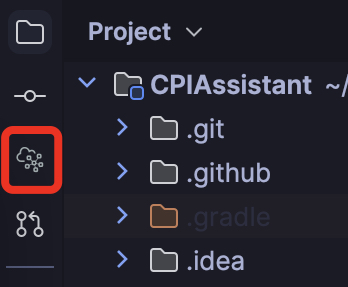

In order to add a new tenant click the `+` button.

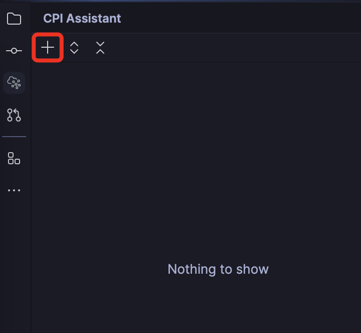

You will see a window to paste service key and name.

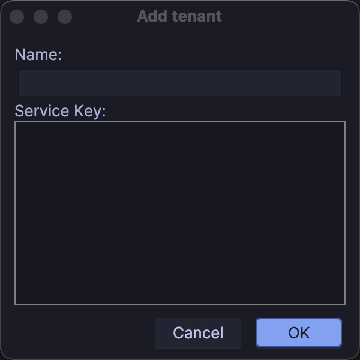

> **Hint:** SAP Process Integration Runtime instance needs to have roles `WorkspaceArtifactsDeploy`,`AuthGroup_IntegrationDeveloper` assigned.

After clicking `OK` button the new tenant will start loading packages, artifacts and scripts.

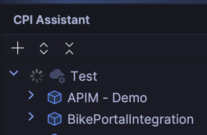

### Mapping/Adding script

For already existing scripts in the tenant you need to map local script first.
Right click on script and choose `Map script`.

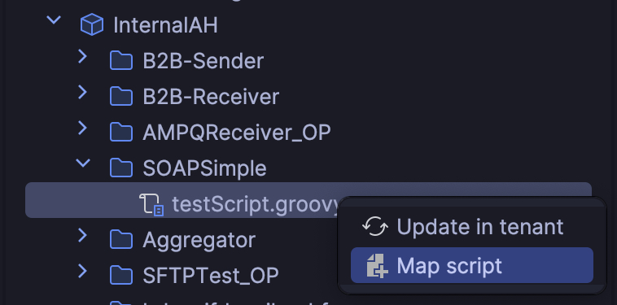

After choosing your script you will see a path next to the script name. Now you are ready to update it in the tenant. Right click on the script again and choose `Update in tenant`.

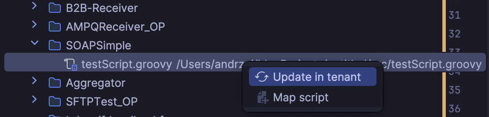

> **Hint:** Make sure the artifact is not locked before updating and deploying from the tool.

### Flow/Script collection deployment

When you have finished with the script update you can now deploy the flow or script collection. Right click on the artifact and choose `Deploy`.

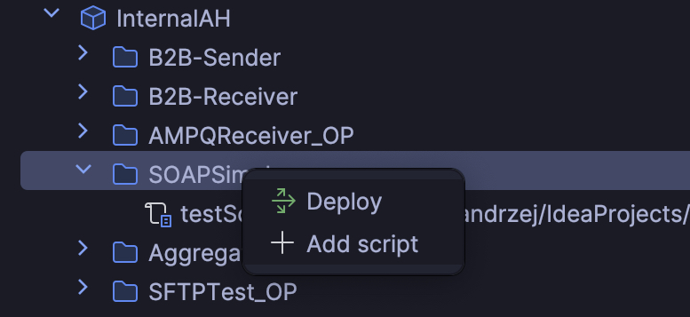

It's also possible to add a new script directly under a flow or script collection with button `Add script`.

## Version 1.2.0

### Artifact refresh and sync of multiple scripts

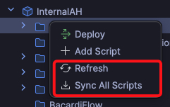

You can now refresh the artifact and sync multiple scripts at once. Right click on the artifact and choose `Refresh`. The plugin will check all scripts under the artifact and if there are any changes in the tenant it will refresh the tree.
If there are multiple scripts in one artifact you can download them all at once. Right click on the artifact and choose `Sync all scripts`.

### Favorites
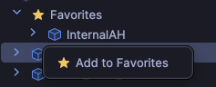

You can now mark your favorite packages with a star icon. Right click on the script and choose `Add to Favorites`. You can view all your favorite scripts in the `Favorites` node. These packages will be loaded first.

### Improved status tracking of deployment and script update
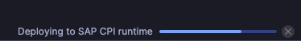

Progress bar will now show the status of deployment and script update.

## Version 1.3.0
### Lazy loading of artifacts and resources
Only packages are loaded on startup. Artifacts and resources are loaded when expanded. Exception is made for favorite packages which are loaded on startup in full scope.
### Added support for XSLT
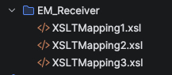

### Download and map single resource
You can now download and map single resource from the tenant. Right click on the resource and choose `Download From Tenant`.

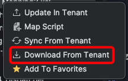

### Favorites support for artifacts and resources. Favorite objects are loaded automatically.
You can now mark your favorite artifacts and resources with a star icon. These will be loaded first. If you mark a whole package or artifact, the whole content will be loaded on startup.

Right click on the artifact/resource and choose `Add to Favorites`.

> **Hint:** You may need to delete favoritePackages node from .idea/TenantState.xml as structure of the file changed.