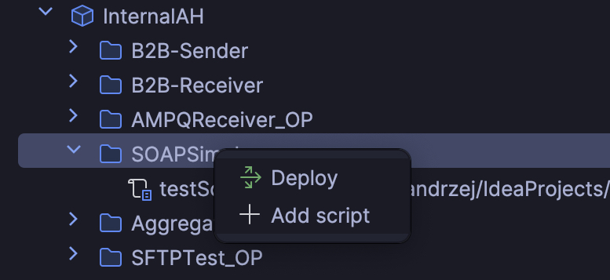

# IntelliJ Plugin: CPI Assistant

## Overview

The plugin enables modification and deployment SAP Cloud Platform Integration Groovy scripts directly within the IDE. 

- Update SAP CPI Groovy scripts directly in IntelliJ</li>
- Deploy artifacts to SAP CPI without leaving the IDE</li>
- Integrated project structure for easy file management</li>
- User-friendly interface for efficient CPI development</li>

## Installation

You can install the plugin directly from the JetBrains Marketplace:

1. Go to `Settings` > `Plugins` > `Marketplace`.
2. Search for `CPI Assistant`.
3. Click `Install`.

Alternatively, you can install it from a local JAR file:

1. Download the latest release from the [Releases](https://github.com/andrzejhalicki/intellij-cpi-assistant/releases) page.
2. Go to `Settings` > `Plugins` > `Install Plugin from Disk`.
3. Select the downloaded JAR file.

## CPI Tenant setup

After installing, you can find the plugin in the toolbar.

In order to add a new tenant click the `+` button.

You will see a window to paste service key and name.

> **Hint:** SAP Process Integration Runtime instance needs to have role `WorkspaceArtifactsDeploy` assigned.

After clicking `OK` button the new tenant will start loading packages, artifacts and scripts.

### Mapping/Adding script

For already existing scripts in the tenant you need to map local script first.
Right click on script and choose `Map script`.

After choosing your script you will see a path next to the script name. Now you are ready to update it in the tenant. Right click on the script again and choose `Update in tenant`.

### Flow/Script collection deployment

When you have finished with the script update you can now deploy the flow or script collection. Right click on the artifact and choose `Deploy`.

It's also possible to add a new script directly under a flow or script collection with button `Add script`.

